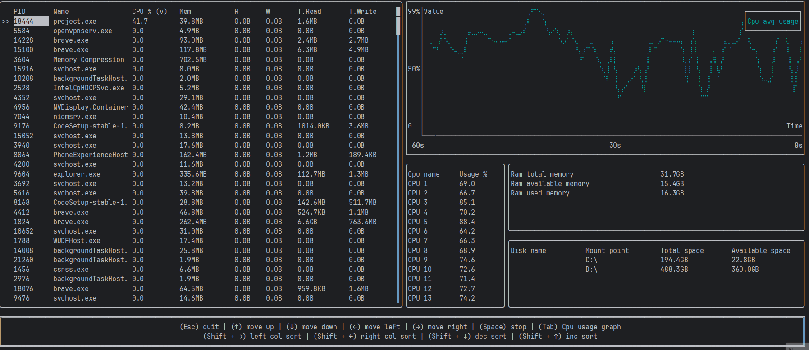

# 🖥️ Rust System Monitor

A modern, terminal-based system monitor written in Rust that provides real-time insights into your system's performance. Built with `ratatui` for beautiful terminal UI and `sysinfo` for comprehensive system data collection.


*Demo showing the system monitor in action*

## ✨ Features

### 📊 **Real-time Process Monitoring**
- **Process List**: View all running processes with detailed information
- **Interactive Sorting**: Sort by PID, name, CPU usage, memory, I/O operations
- **Live Updates**: Real-time data refresh for accurate monitoring
- **Process Selection**: Navigate through processes with keyboard controls

### 🖥️ **System Resource Monitoring**
- **CPU Usage**: Per-core CPU utilization with average calculations
- **Memory Usage**: RAM total, available, and used memory tracking
- **Disk Information**: Storage usage across all mounted drives
- **Live Charts**: Animated graphs showing resource usage over time

### 🎨 **Beautiful Terminal Interface**
- **Modern UI**: Clean, responsive design using `ratatui`
- **Interactive Charts**: Real-time line graphs for process and system metrics
- **Color-coded Data**: Intuitive color scheme for better readability
- **Keyboard Navigation**: Full keyboard control for efficient monitoring

### 📈 **Advanced Analytics**
- **Historical Data**: Track resource usage trends over time
- **Process History**: Monitor individual process performance
- **Customizable Views**: Switch between different data visualizations

## 🚀 Installation

### Prerequisites
- Rust 1.70+ (2024 edition)
- A terminal that supports Unicode and colors

### Build from Source

1. **Clone the repository**
   ```bash
   git clone <repository-url>
   cd project
   ```

2. **Build the project**
   ```bash
   cargo build --release
   ```

3. **Run the application**
   ```bash
   cargo run --release
   ```

### Quick Start
```bash
# Run in development mode
cargo run

# Run with optimizations
cargo run --release

# Run example
cargo run --example process
```

## 🎮 Usage

### Navigation Controls
- **Arrow Keys**: Navigate through processes and columns
- **Tab/Shift+Tab**: Switch between different sections
- **Enter**: Select a process for detailed monitoring
- **Space**: Toggle between different chart views
- **q**: Quit the application

### Sorting Options
- **CPU Usage**: Sort by processor utilization
- **Memory**: Sort by RAM usage
- **I/O Operations**: Sort by read/write operations
- **Process Name**: Alphabetical sorting
- **PID**: Process ID sorting

### Chart Views
- **System CPU**: Overall CPU usage over time
- **Process Metrics**: Individual process performance
- **Memory Trends**: RAM usage patterns
- **I/O Activity**: Disk read/write operations

## 🏗️ Architecture

### Project Structure
```
src/
├── main.rs              # Application entry point
├── app/                 # Application logic
│   ├── mod.rs
│   ├── runner.rs        # Main application loop
│   ├── state.rs         # Application state management
│   └── ui.rs            # User interface rendering
├── models/              # Data models
│   ├── mod.rs
│   ├── process.rs       # Process information structures
│   ├── system.rs        # System resource structures
│   └── types.rs         # Type definitions
└── utils/               # Utility functions
    ├── mod.rs
    └── helpers.rs       # Helper functions
```

### Key Components

- **`App`**: Main application state and logic
- **`ProcessInfo`**: Individual process data structure
- **`GeneralInfo`**: System-wide resource information
- **`ProcessInfoHistory`**: Historical data for charts
- **UI Components**: Modular rendering system


## 📊 Performance

- **Low Resource Usage**: Minimal CPU and memory footprint
- **Efficient Updates**: Smart data refresh strategies
- **Smooth Rendering**: Optimized terminal rendering
- **Cross-platform**: Works on Windows, macOS, and Linux


## 📝 License

This project is licensed under the MIT License - see the [LICENSE](LICENSE) file for details.

---


*Built for developers who love terminal-based tools and system monitoring*
